# Mermaid 차트 전체 모음

사용자 제공 설계의 Mermaid 차트 코드를 개별 파일과 함께 모은 문서입니다.

## 0. 전체 오케스트레이션

파일: `mermaid charts/00_overall_orchestration.mmd`

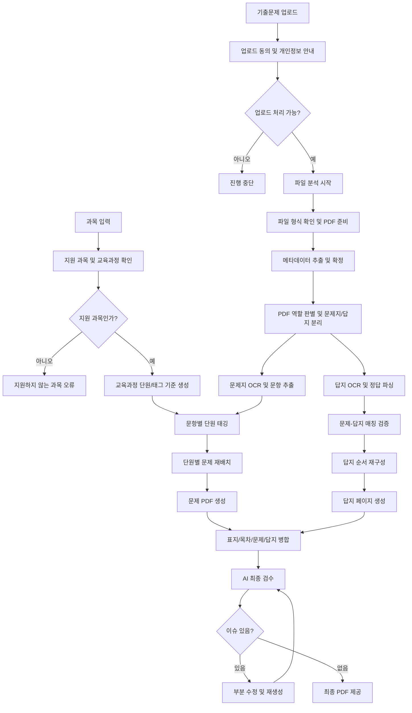

## 1. 업로드, 동의, 과목 검증

파일: `mermaid charts/01_upload_consent_subject_validation.mmd`

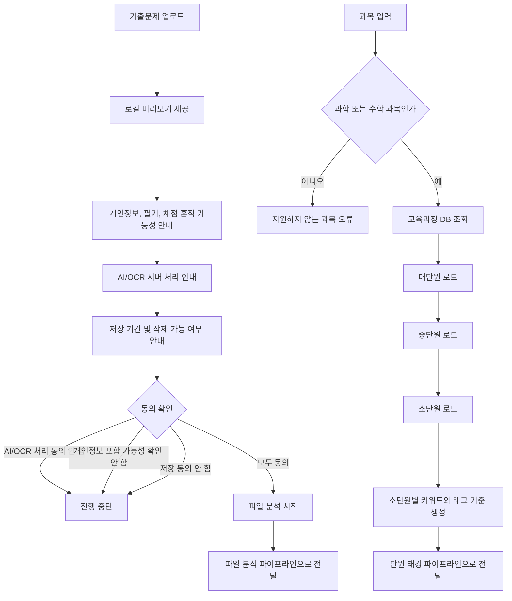

## 2. 파일 형식 확인 및 메타데이터 확정

파일: `mermaid charts/02_file_format_metadata.mmd`

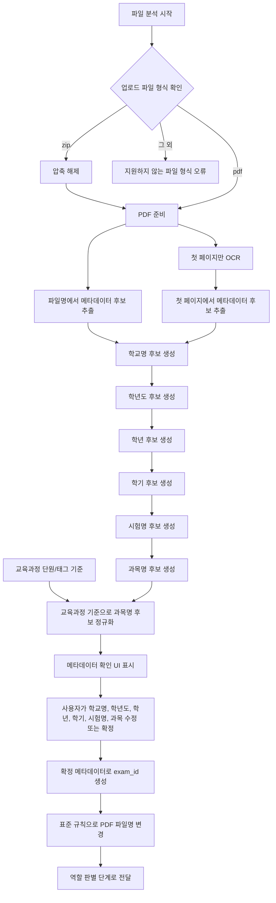

## 3. PDF 역할 판별 및 문제지/답지 분리

파일: `mermaid charts/03_pdf_role_detection_split.mmd`

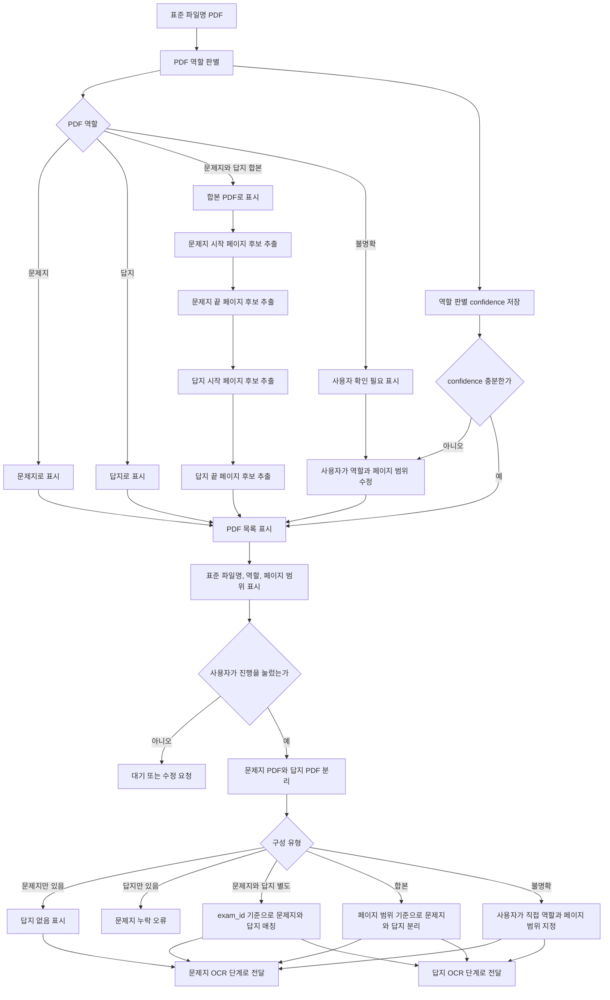

## 4. OCR, 답지 파싱, 단원 태깅

파일: `mermaid charts/04_ocr_answer_parsing_unit_tagging.mmd`

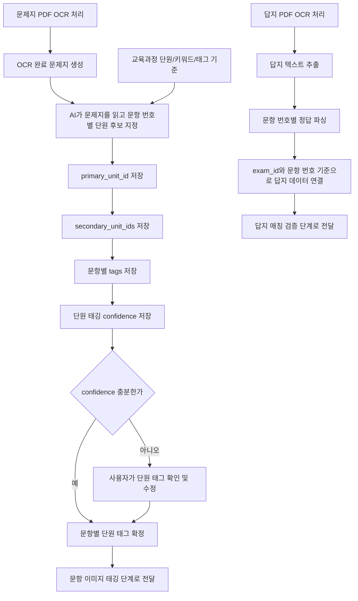

## 5. 문항 이미지 추출 및 품질 검수

파일: `mermaid charts/05_question_image_extraction_quality_check.mmd`

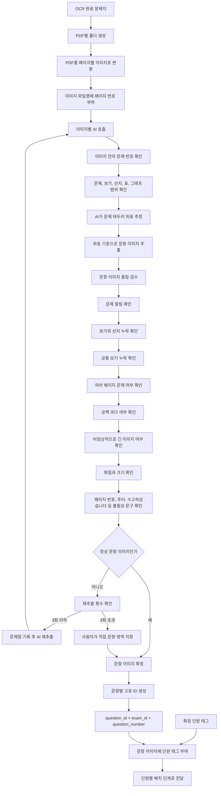

## 6. 단원별 배치 및 문제 PDF 생성

파일: `mermaid charts/06_unit_arrangement_problem_pdf_generation.mmd`

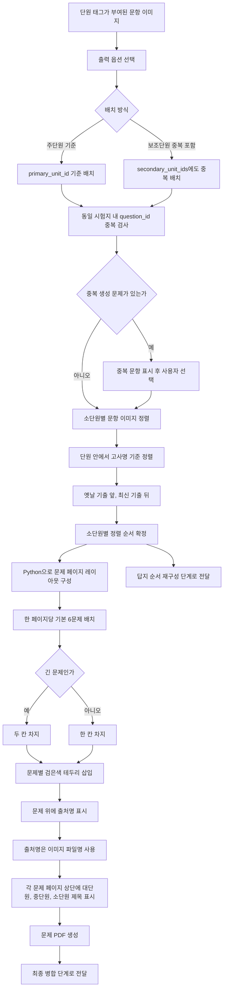

## 7. 답지 재구성, 표지, 목차, 최종 병합

파일: `mermaid charts/07_answer_cover_toc_final_merge.mmd`

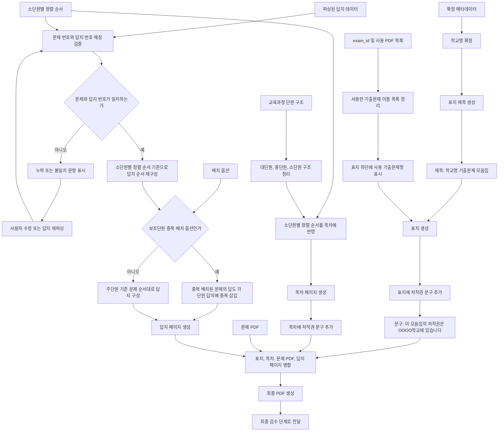

## 8. 최종 검수 및 이슈 수정 루프

파일: `mermaid charts/08_final_review_issue_loop.mmd`

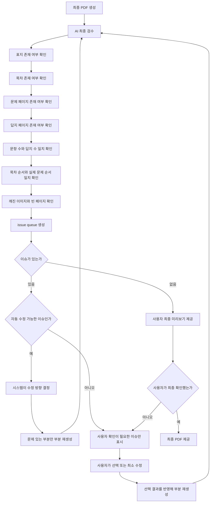

## 9. AI 호출 시점 전용 다이어그램

파일: `mermaid charts/09_ai_call_sequence.mmd`

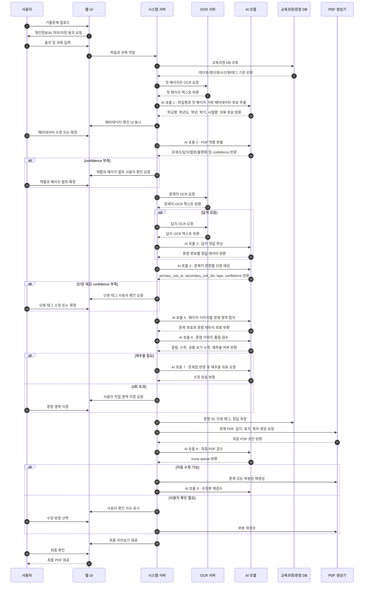

## 10. 상태 패널만 따로 분리

파일: `mermaid charts/10_status_panel.mmd`

```mermaid
flowchart TD
    STATUS["처리 상태 패널"]

    A["기출문제 업로드"] -.-> STATUS
    A5["동의 확인 완료"] -.-> STATUS
    B6["교육과정 단원 기준 생성"] -.-> STATUS
    D12["메타데이터 확정"] -.-> STATUS
    E14["PDF 역할/페이지 범위 표시"] -.-> STATUS
    G1["문제지 OCR 처리"] -.-> STATUS
    G2["답지 OCR 처리"] -.-> STATUS
    H9["문항별 단원 태그 확정"] -.-> STATUS
    J11["문항 이미지 확정"] -.-> STATUS
    L11["소단원별 정렬 순서 확정"] -.-> STATUS
    M10["문제 PDF 생성"] -.-> STATUS
    N9["답지 페이지 생성"] -.-> STATUS
    Q2["최종 PDF 생성"] -.-> STATUS
    S3["최종 PDF 제공"] -.-> STATUS

    STATUS --> S0["0. 업로드 대기"]
    STATUS --> S1["1. 동의 확인"]
    STATUS --> S2["2. 파일 분석"]
    STATUS --> S3A["3. 메타데이터 확인"]
    STATUS --> S4["4. PDF 역할 판별"]
    STATUS --> S5["5. OCR 처리"]
    STATUS --> S6["6. 문항 추출"]
    STATUS --> S7["7. 단원 태깅"]
    STATUS --> S8["8. 문제집 생성"]
    STATUS --> S9["9. 최종 검수"]
    STATUS --> S10["10. 완료"]
```

## 99. 원본 단일 전체 Mermaid flowchart

```mermaid
flowchart TD
    A["기출문제 업로드"]
    B["과목 입력"]

    A --> A1["로컬 미리보기 제공"]
    A1 --> A2["개인정보, 필기, 채점 흔적 가능성 안내"]
    A2 --> A3["AI/OCR 서버 처리 안내"]
    A3 --> A4["저장 기간 및 삭제 가능 여부 안내"]
    A4 --> A5{"동의 확인"}
    A5 -->|AI/OCR 처리 동의 안 함| X1["진행 중단"]
    A5 -->|개인정보 포함 가능성 확인 안 함| X1
    A5 -->|저장 동의 안 함| X1
    A5 -->|모두 동의| C1["파일 분석 시작"]

    B --> B1{"과학 또는 수학 과목인가"}
    B1 -->|아니오| X2["지원하지 않는 과목 오류"]
    B1 -->|예| B2["교육과정 DB 조회"]
    B2 --> B3["대단원 로드"]
    B3 --> B4["중단원 로드"]
    B4 --> B5["소단원 로드"]
    B5 --> B6["소단원별 키워드와 태그 기준 생성"]

    C1 --> C2{"업로드 파일 형식 확인"}
    C2 -->|zip| C3["압축 해제"]
    C3 --> C4["개별 PDF 분리"]
    C2 -->|pdf| C4
    C2 -->|그 외| X3["지원하지 않는 파일 형식 오류"]

    C4 --> D1["파일명에서 메타데이터 후보 추출"]
    C4 --> D2["첫 페이지만 OCR"]
    D2 --> D3["첫 페이지에서 메타데이터 후보 추출"]
    D1 --> D4["학교명 후보 생성"]
    D3 --> D4
    D4 --> D5["학년도 후보 생성"]
    D5 --> D6["학년 후보 생성"]
    D6 --> D7["학기 후보 생성"]
    D7 --> D8["시험명 후보 생성"]
    D8 --> D9["과목명 후보 생성"]
    B6 --> D10["교육과정 기준으로 과목명 후보 정규화"]
    D9 --> D10

    D10 --> D11["메타데이터 확인 UI 표시"]
    D11 --> D12["사용자가 학교명, 학년도, 학년, 학기, 시험명, 과목 수정 또는 확정"]
    D12 --> D13["확정 메타데이터로 exam_id 생성"]
    D13 --> D14["표준 규칙으로 PDF 파일명 변경"]

    D14 --> E1["PDF 역할 판별"]
    E1 --> E2{"PDF 역할"}
    E2 -->|문제지| E3["문제지로 표시"]
    E2 -->|답지| E4["답지로 표시"]
    E2 -->|문제지와 답지 합본| E5["합본 PDF로 표시"]
    E2 -->|불명확| E6["사용자 확인 필요 표시"]

    E5 --> E7["문제지 시작 페이지 후보 추출"]
    E7 --> E8["문제지 끝 페이지 후보 추출"]
    E8 --> E9["답지 시작 페이지 후보 추출"]
    E9 --> E10["답지 끝 페이지 후보 추출"]

    E1 --> E11["역할 판별 confidence 저장"]
    E11 --> E12{"confidence 충분한가"}
    E12 -->|아니오| E13["사용자가 역할과 페이지 범위 수정"]
    E12 -->|예| E14["PDF 목록 표시"]
    E13 --> E14
    E3 --> E14
    E4 --> E14
    E10 --> E14
    E6 --> E13

    E14 --> E15["표준 파일명, 역할, 페이지 범위 표시"]
    E15 --> E16{"사용자가 진행을 눌렀는가"}
    E16 -->|아니오| X4["대기 또는 수정 요청"]
    E16 -->|예| F1["문제지 PDF와 답지 PDF 분리"]

    F1 --> F2{"구성 유형"}
    F2 -->|문제지만 있음| F3["답지 없음 표시"]
    F2 -->|답지만 있음| X5["문제지 누락 오류"]
    F2 -->|문제지와 답지 별도| F4["exam_id 기준으로 문제지와 답지 매칭"]
    F2 -->|합본| F5["페이지 범위 기준으로 문제지와 답지 분리"]
    F2 -->|불명확| F6["사용자가 직접 역할과 페이지 범위 지정"]

    F3 --> G1["문제지 PDF OCR 처리"]
    F4 --> G1
    F5 --> G1
    F6 --> G1

    F4 --> G2["답지 PDF OCR 처리"]
    F5 --> G2
    F6 --> G2

    G2 --> G3["답지 텍스트 추출"]
    G3 --> G4["문항 번호별 정답 파싱"]
    G4 --> G5["exam_id와 문항 번호 기준으로 답지 데이터 연결"]

    G1 --> H1["OCR 완료 문제지 생성"]
    H1 --> H2["AI가 문제지를 읽고 문항 번호별 단원 후보 지정"]
    B6 --> H2
    H2 --> H3["primary_unit_id 저장"]
    H3 --> H4["secondary_unit_ids 저장"]
    H4 --> H5["문항별 tags 저장"]
    H5 --> H6["단원 태깅 confidence 저장"]
    H6 --> H7{"confidence 충분한가"}
    H7 -->|아니오| H8["사용자가 단원 태그 확인 및 수정"]
    H7 -->|예| H9["문항별 단원 태그 확정"]
    H8 --> H9

    H1 --> I1["PDF별 폴더 생성"]
    I1 --> I2["PDF를 페이지별 이미지로 변환"]
    I2 --> I3["이미지 파일명에 페이지 번호 부여"]
    I3 --> I4["이미지별 AI 호출"]
    I4 --> I5["이미지 안의 문제 번호 확인"]
    I5 --> I6["문제, 보기, 선지, 표, 그래프 범위 확인"]
    I6 --> I7["AI가 문제 테두리 좌표 추정"]
    I7 --> I8["좌표 기준으로 문항 이미지 추출"]

    I8 --> J1["문항 이미지 품질 검수"]
    J1 --> J2["문제 잘림 확인"]
    J2 --> J3["보기와 선지 누락 확인"]
    J3 --> J4["공통 보기 누락 확인"]
    J4 --> J5["여러 페이지 문제 여부 확인"]
    J5 --> J6["공백 과다 여부 확인"]
    J6 --> J7["비정상적으로 긴 이미지 여부 확인"]
    J7 --> J8["화질과 크기 확인"]
    J8 --> J9["페이지 번호, 푸터, 수고하셨습니다 등 불필요 문구 확인"]
    J9 --> J10{"정상 문항 이미지인가"}

    J10 -->|예| J11["문항 이미지 확정"]
    J10 -->|아니오| J12["재추출 횟수 확인"]
    J12 -->|3회 이하| J13["문제점 기록 후 AI 재추출"]
    J13 --> I4
    J12 -->|3회 초과| J14["사용자가 직접 문항 영역 지정"]
    J14 --> J11

    J11 --> K1["문항별 고유 ID 생성"]
    K1 --> K2["question_id = exam_id + question_number"]
    H9 --> K3["문항 이미지에 단원 태그 부여"]
    K2 --> K3

    K3 --> L1["출력 옵션 선택"]
    L1 --> L2{"배치 방식"}
    L2 -->|주단원 기준| L3["primary_unit_id 기준 배치"]
    L2 -->|보조단원 중복 포함| L4["secondary_unit_ids에도 중복 배치"]
    L3 --> L5["동일 시험지 내 question_id 중복 검사"]
    L4 --> L5

    L5 --> L6{"중복 생성 문제가 있는가"}
    L6 -->|예| L7["중복 문항 표시 후 사용자 선택"]
    L6 -->|아니오| L8["소단원별 문항 이미지 정렬"]
    L7 --> L8

    L8 --> L9["단원 안에서 고사명 기준 정렬"]
    L9 --> L10["옛날 기출 앞, 최신 기출 뒤"]
    L10 --> L11["소단원별 정렬 순서 확정"]

    L11 --> M1["Python으로 문제 페이지 레이아웃 구성"]
    M1 --> M2["한 페이지당 기본 6문제 배치"]
    M2 --> M3{"긴 문제인가"}
    M3 -->|예| M4["두 칸 차지"]
    M3 -->|아니오| M5["한 칸 차지"]
    M4 --> M6["문제별 검은색 테두리 삽입"]
    M5 --> M6
    M6 --> M7["문제 위에 출처명 표시"]
    M7 --> M8["출처명은 이미지 파일명 사용"]
    M8 --> M9["각 문제 페이지 상단에 대단원, 중단원, 소단원 제목 표시"]
    M9 --> M10["문제 PDF 생성"]

    G5 --> N1["문제 번호와 답지 번호 매칭 검증"]
    L11 --> N1
    N1 --> N2{"문제와 답지 번호가 일치하는가"}
    N2 -->|아니오| N3["누락 또는 불일치 문항 표시"]
    N3 --> N4["사용자 수정 또는 답지 재파싱"]
    N4 --> N1
    N2 -->|예| N5["소단원별 정렬 순서 기준으로 답지 순서 재구성"]

    L2 --> N6{"보조단원 중복 배치 옵션인가"}
    N5 --> N6
    N6 -->|예| N7["중복 배치된 문제의 답도 각 단원 답지에 중복 삽입"]
    N6 -->|아니오| N8["주단원 기준 문제 순서대로 답지 구성"]
    N7 --> N9["답지 페이지 생성"]
    N8 --> N9

    D12 --> O1["학교명 확정"]
    O1 --> O2["표지 제목 생성"]
    O2 --> O3["제목: 학교명 기출문제 모음집"]
    D13 --> O4["사용한 기출문제 이름 목록 정리"]
    O4 --> O5["표지 하단에 사용 기출문제명 표시"]
    O3 --> O6["표지 생성"]
    O5 --> O6
    O6 --> O7["표지에 저작권 문구 추가"]
    O7 --> O8["문구: 이 모음집의 저작권은 OOOO학교에 있습니다"]

    B6 --> P1["교육과정의 대단원, 중단원, 소단원 구조 정리"]
    L11 --> P2["소단원별 정렬 순서를 목차에 반영"]
    P1 --> P2
    P2 --> P3["목차 페이지 생성"]
    P3 --> P4["목차에 저작권 문구 추가"]

    O8 --> Q1["표지, 목차, 문제 PDF, 답지 페이지 병합"]
    P4 --> Q1
    M10 --> Q1
    N9 --> Q1
    Q1 --> Q2["최종 PDF 생성"]

    Q2 --> R1["AI 최종 검수"]
    R1 --> R2["표지 존재 여부 확인"]
    R2 --> R3["목차 존재 여부 확인"]
    R3 --> R4["문제 페이지 존재 여부 확인"]
    R4 --> R5["답지 페이지 존재 여부 확인"]
    R5 --> R6["문항 수와 답지 수 일치 확인"]
    R6 --> R7["목차 순서와 실제 문제 순서 일치 확인"]
    R7 --> R8["깨진 이미지와 빈 페이지 확인"]
    R8 --> R9["issue queue 생성"]

    R9 --> R10{"이슈가 있는가"}
    R10 -->|없음| S1["사용자 최종 미리보기 제공"]
    R10 -->|있음| R11{"자동 수정 가능한 이슈인가"}

    R11 -->|예| R12["시스템이 수정 방향 결정"]
    R12 --> R13["문제 있는 부분만 부분 재생성"]
    R13 --> R1

    R11 -->|아니오| R14["사용자 확인이 필요한 이슈만 표시"]
    R14 --> R15["사용자가 선택 또는 최소 수정"]
    R15 --> R16["선택 결과를 반영해 부분 재생성"]
    R16 --> R1

    S1 --> S2{"사용자가 최종 확인했는가"}
    S2 -->|아니오| R14
    S2 -->|예| S3["최종 PDF 제공"]

    A -.-> STATUS["처리 상태 패널 업데이트"]
    A5 -.-> STATUS
    B6 -.-> STATUS
    D12 -.-> STATUS
    E14 -.-> STATUS
    G1 -.-> STATUS
    G2 -.-> STATUS
    H9 -.-> STATUS
    J11 -.-> STATUS
    L11 -.-> STATUS
    M10 -.-> STATUS
    N9 -.-> STATUS
    Q2 -.-> STATUS

```
